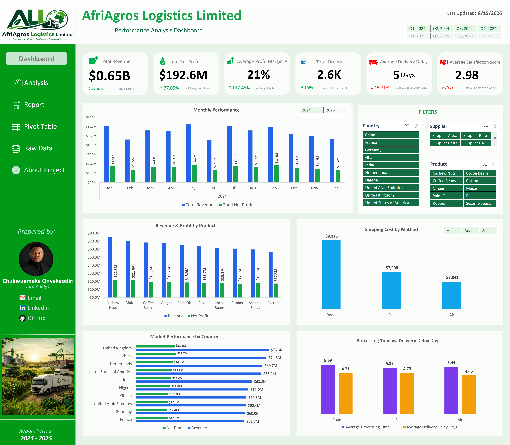
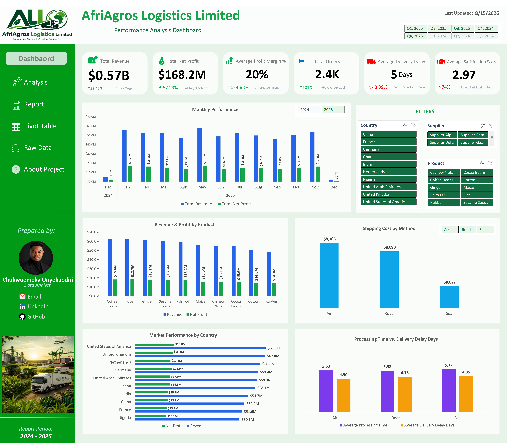

# Dashboard Analysis | Key Findings

## Overview

The completed dashboard brought together the financial, product, market, operational, logistics, and customer-experience measures developed throughout the project.

At this stage, I moved from building the reporting solution to interpreting what the data was communicating. The dashboard provided the high-level view, while the PivotTable analysis allowed me to investigate specific results further when a pattern required additional explanation.

The objective was not to document every number produced by the analysis. Instead, I focused on findings that were important enough to influence how the business performance should be understood or where management may need to investigate further.

---

# Overall Business Performance

At the overall level, the business generated approximately **$1.22 billion in Revenue** and **$360.8 million in Net Profit**, resulting in an overall Profit Margin of approximately **20%**.

This indicates that the business was profitable at the aggregate level. However, the overall result alone did not provide enough information to determine whether the business was improving, where the financial performance was coming from, or whether operational issues were hidden beneath the strong totals.

This became particularly important when the analysis was broken down by product, country, supplier, and year.

---

# Revenue and Profitability

The comparison between Revenue and Net Profit showed that the business generated substantial profit alongside its high Revenue.

However, the analysis also demonstrated why Revenue should not be used as the only measure of business performance. A product or market can generate high Revenue without necessarily producing the strongest profitability.

This is why the dashboard combines **Revenue, Net Profit, and Profit Margin** rather than presenting Revenue alone.

The combination provides a more complete financial picture:

- Revenue shows the scale of business activity.
- Net Profit shows the financial result after relevant costs.
- Profit Margin shows how efficiently Revenue is being converted into profit.

This became particularly useful during the product and market analysis.

---

# Product Performance

Product-level analysis revealed differences in the contribution of individual products to overall business performance.

One important analytical observation was that high Revenue could be strongly influenced by **Order Quantity**. This means that a product generating substantial Revenue should not automatically be interpreted as having the strongest pricing or profitability performance.

The PivotTable analysis allowed me to compare Revenue with Quantity, Net Profit, and Profit Margin rather than stopping at the highest Revenue figure.

This led to a more useful business question:

> **Is a product generating strong Revenue because it is highly profitable, because it sells in large quantities, or because of a combination of both?**

This distinction is important because increasing sales volume and improving profitability are not necessarily the same business objective.

---

# Country Performance

Country-level analysis showed that financial performance was not evenly distributed across markets.

The **United Kingdom** was one of the strongest contributors, generating approximately **$136.1 million in Revenue** and **$39.5 million in Net Profit**.

This makes the market an important contributor to overall business performance, but the result should not be interpreted simply as a reason to focus exclusively on the strongest market.

The more useful management question is whether the performance of stronger markets can be understood and replicated in other markets, and whether lower-performing markets require additional investigation.

Country analysis therefore provides a starting point for questions around market demand, product mix, order volume, pricing, and operational conditions.

---

# Supplier Performance

Supplier analysis was used to determine whether financial performance varied meaningfully across suppliers.

The results showed that supplier contribution was not uniform, with some suppliers contributing more strongly to overall Revenue and Net Profit than others.

This provides management with another useful dimension for investigating business performance. However, supplier rankings should not be interpreted as a direct measure of supplier quality because the available dataset does not contain enough information about supplier pricing agreements, product quality, service levels, or contract terms.

The analysis can identify where supplier-related performance differs, but additional operational information would be required before making supplier-management decisions.

---

# 2024 vs. 2025 Performance

The year-over-year comparison produced one of the more important findings from the analysis.

Although the overall business remained profitable, **2025 performed below 2024 in both Revenue and Net Profit**.

This was important because the overall business totals could initially create the impression of consistently strong performance. Comparing the two years revealed that the business had experienced a deterioration in financial performance during the second year of the reporting period.

This changed the analytical question from:

> **Is the business profitable?**

to:

> **Why did financial performance decline in 2025 despite the business remaining profitable overall?**

This is an example of why trend analysis is important. A single overall KPI can show the current position, but year-over-year comparison can reveal the direction in which the business is moving.

### 2024 Performance

### 2025 Performance

---

# Quarterly Performance

The annual comparison led to a deeper quarterly investigation to determine whether the decline in 2025 was consistent throughout the year or concentrated in particular periods.

The quarterly analysis showed that the weaker 2025 performance became more apparent in the later part of the year.

This provides a more useful management signal than simply stating that 2025 was weaker. It identifies the period where additional investigation should begin.

The next analytical step would be to investigate the products, countries, suppliers, and order activity contributing to the weaker quarters.

### Analytical Question

> **Which quarters contributed most to the change in performance between 2024 and 2025?**

---

# Monthly Performance

Monthly analysis provided another level of detail by showing how Revenue and Net Profit changed throughout the reporting period.

The monthly view helped identify periods of stronger and weaker performance and provided a way to investigate unusual movements that could otherwise be hidden by annual totals.

One particularly unusual result appeared in **December 2025**, where performance was substantially weaker than surrounding periods.

This should be treated as an **investigation point rather than an automatic business conclusion**. A sharp monthly decline may reflect a genuine business event, seasonal conditions, changes in order activity, or a potential data or reporting issue.

The appropriate management response would therefore be to validate the underlying transactions and investigate what changed during the period before taking corrective action.

---

# Operational Performance

The operational analysis considered Processing Time, Delivery Delay, and Shipping Method together rather than relying on a single operational metric.

This was important because operational performance can involve trade-offs. A shipping method may have a different cost profile while also producing different processing or delivery outcomes.

The analysis therefore avoided making a simplistic conclusion that one shipping method was automatically the best.

Instead, the results provide management with areas for further investigation around:

- Shipping Cost
- Processing Time
- Delivery Delay
- Order volume
- Customer Satisfaction

This multi-dimensional approach is more useful for operational decision-making than evaluating shipping methods using cost alone.

---

# Customer Satisfaction

Customer Satisfaction Score was included in the dashboard to ensure that financial and operational performance were not evaluated independently of customer experience.

The overall satisfaction result provided a useful indicator of customer experience, but the dataset had an important limitation: it contained the satisfaction score without detailed information explaining the reasons behind the score.

Therefore, while the analysis can identify differences in satisfaction across selected dimensions, it cannot reliably determine the underlying causes of dissatisfaction.

This distinction is important because management should not assume that a lower satisfaction score is caused by a particular operational factor unless additional evidence supports that conclusion.

---

# Key Analytical Insights

After reviewing the dashboard and the deeper PivotTable analysis, the most important insights were:

### 1. The business was profitable overall, but the trend required attention.

The company generated approximately **$1.22B in Revenue** and **$360.8M in Net Profit**, but the year-over-year comparison showed weaker Revenue and Net Profit in 2025 compared with 2024.

### 2. Revenue scale and profitability should be analyzed together.

Product performance showed that high Revenue can be influenced by Order Quantity. Revenue alone therefore does not provide a complete picture of product performance.

### 3. Market contribution was concentrated.

The United Kingdom was a particularly strong contributor, generating approximately **$136.1M in Revenue** and **$39.5M in Net Profit**. This creates an opportunity to investigate what is driving stronger market performance and whether similar characteristics exist elsewhere.

### 4. The decline in 2025 requires time-based investigation.

The quarterly and monthly analysis provided evidence that the weaker 2025 performance was not simply an annual statistical difference. The later periods of the year require further investigation to understand what contributed to the decline.

### 5. Operational performance requires multiple measures.

Shipping Cost, Processing Time, Delivery Delay, and Customer Satisfaction should be considered together rather than evaluating operational performance through Shipping Method alone.

### 6. Some findings require additional data before a definitive conclusion can be made.

The available dataset is useful for identifying patterns, but variables such as shipment distance, shipment weight, freight agreements, detailed customer feedback, and other operational factors would allow deeper investigation into the causes behind some of the observed patterns.

---

# From Finding to Business Question

An important outcome of the analysis was that some findings should not immediately become recommendations without further investigation.

For example, identifying a decline in 2025 does not automatically explain why it happened. Identifying a country with strong Revenue does not automatically mean that resources should be increased there. Identifying a shipping method with higher Shipping Cost does not automatically mean that the method should be replaced.

Instead, the findings provide management with **evidence-based questions for the next stage of investigation**.

This distinction helped me separate what the dataset clearly demonstrated from what would require additional information before a business decision could be justified.

---

# Analysis Limitations

The analysis was based on the fields available in the dataset, which means some business questions could only be investigated to a certain level.

Important limitations included:

- No detailed shipment-weight information.
- No shipment-distance information.
- No detailed freight or logistics contract information.
- No detailed customer complaint or feedback categories.
- No external market information.
- No additional operational variables explaining unusual monthly movements.

These limitations do not prevent the analysis from identifying meaningful patterns, but they should be considered when interpreting the findings and developing recommendations.

---

# Dashboard Analysis Outcome

The completed dashboard successfully provided management with a high-level view of financial, product, market, operational, and customer performance while allowing users to investigate specific areas through interactive slicers.

More importantly, the combination of the dashboard and PivotTable exploration demonstrated that the most useful findings were not always visible from the initial KPI cards alone.

The dashboard answered the primary questions quickly, while the exploratory analysis allowed me to investigate the results further and determine which patterns were important enough to carry forward into business recommendations.

The next stage is therefore to translate the most important findings into practical recommendations while clearly separating **what the data demonstrates** from **what management should investigate or consider doing next**.
